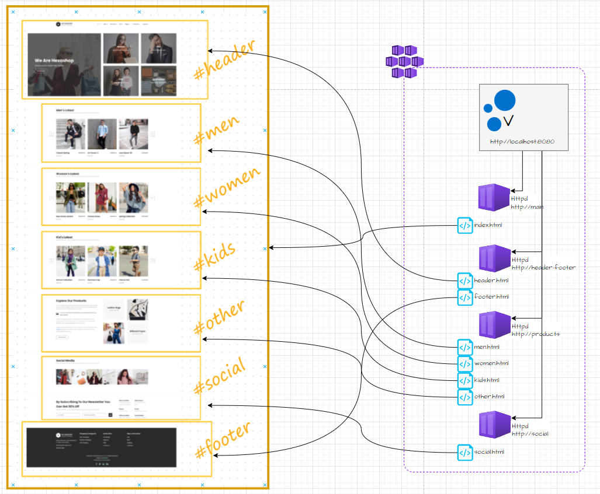

# Introduction

Ce document fait suite au besoin de ségrégation des composants métier.

Le site web à mettre en place présente des briques fonctionnelles produites par différentes équipes bien distinctes. Chaque équipe est maitresse de son code et du cycle de vie des composants qu'elle produit.

L'utilisation de micro-frontend permet à chaque équipe d'avoir la liberté de déployer, quand elle le souhaite, les nouvelles versions de ses composants sans attendre une fusion de code préalable.

[ajouter un schéma]


# Proposition


[Varnish cache](https://www.varnish-software.com/products/varnish-cache/) est l'un des proxy cache prenant en charge les [esi](https://fr.wikipedia.org/wiki/Edge_Side_Includes) (edge side includes) ([voir ici](https://varnish-cache.org/docs/7.5/tutorial/introduction.html#content-composition-with-varnish))

il permet

* la mise en cache 
* la composition dynamique

### Présentation

Le poc présenté 




## Procédure

### Composition par edge side includes

Le site est composé de plusieurs pages. Focalisons nous sur la page d'accueil.

Elle embarque 7 zones présentées sur le schéma ci-dessus. Chaque zone est desservie par une application web distincte de l'application principale.

**Dans le code html** de la page index.html, des balises d'inclusion de fragments sont insérés

```html
<esi:include src="http://<<url>>" />
```

Lors du rendu de la page, Varnish remplacera ces balises `esi:include` par le fragment récupéré

### Création de la solution avec des conteneurs

Nous allons utiliser 2 images :`varnish:7.5.0` et `httpd:latest`

#### Varnish

Le fichier default.vcl est ajouté en tant que volume

#### httpd

Le dossier contenant les fichiers html est ajouté en tant que volume

#### docker compose

<span style="callout:code-header">docker-compose.yml</span>

```yaml
version: "3.8"

services:

  varnish:
    image: varnish:7.5.0
    volumes:
      - ./varnish/default.vcl:/etc/varnish/default.vcl
    ports: 
      - 8080:80
  
  main:
    image: httpd:latest
    volumes:
      - ./main:/usr/local/apache2/htdocs/
    ports:
      - 8081:80
  
  header-footer:
    image: httpd:latest
    volumes:
      - ./header-footer:/usr/local/apache2/htdocs/
    ports:
      - 8082:80
  
  products:
    image: httpd:latest
    volumes:
      - ./products:/usr/local/apache2/htdocs/
    ports:
      - 8083:80
  
  social:
    image: httpd:latest
    volumes:
      - ./social:/usr/local/apache2/htdocs/
    ports:
      - 8084:80
```

#### configuration Varnish

<span style="callout:code-header">default.vcl</span>

```python
# specify the VCL syntax version to use
vcl 4.1;

import dynamic;

# Définition des backends (A mettre en relation avec les services dans le docker-compose.yml)
backend default {
	.host = "main";
	.port = "80";
} 

backend header-footer {
	.host = "header-footer";
	.port = "80";
} 
backend products {
	.host = "products";
	.port = "80";
} 

backend social {
	.host = "social";
	.port = "80";
} 

# Ajout de headers pour le debug
sub vcl_deliver {
    if (obj.hits > 0) {
        set resp.http.X-Cache = "HIT";
    } else {
        set resp.http.X-Cache = "MISS";
    }
    set resp.http.X-Cache-Hits = obj.hits;
    return (deliver);
}

# Activation des ESI et ttl de 5s
sub vcl_backend_response {
    set beresp.do_esi = true;
    set beresp.ttl = 5s;
}

# Routage spécifique
sub vcl_recv {
    if(req.http.host ~ "header-footer") { set req.backend_hint = header-footer; }    
    if(req.http.host ~ "products") { set req.backend_hint = products; }    
    if(req.http.host ~ "social") { set req.backend_hint = social; }  
}
```


#### Exécution

se positionner dans le dossier du `docker-compose.yml`

```bash
docker compose up
```

